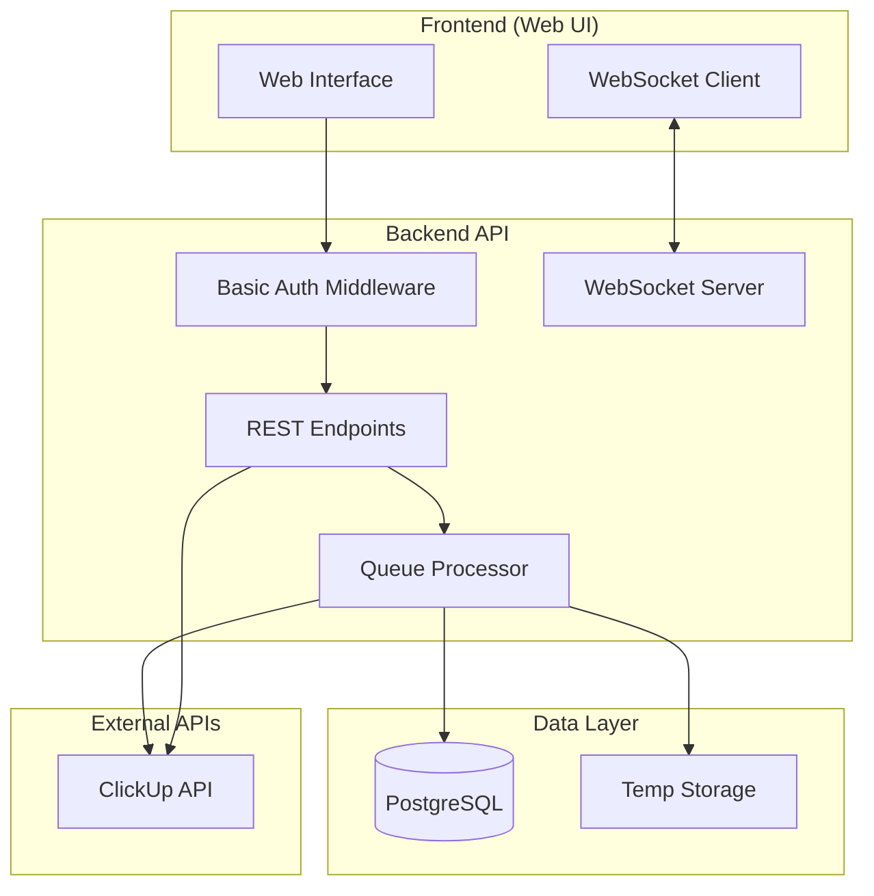

# Design Document

## Overview

O ClickUp Field Updater é uma extensão web da API ClickUp Excel existente que adiciona uma interface frontend para atualização em massa de campos personalizados do ClickUp. O sistema mantém a arquitetura backend existente em Go e adiciona um frontend web com autenticação básica, sistema de filas PostgreSQL, WebSockets para progresso em tempo real, e funcionalidades de upload/mapeamento de arquivos.

A solução reutiliza a infraestrutura existente de rate limiting, retry com backoff, e streaming de dados, estendendo-a com novas capacidades de atualização de campos e interface web interativa.

## Architecture

### High-Level Architecture



### Component Architecture

O sistema segue a arquitetura limpa existente com as seguintes camadas:

1. **Presentation Layer**: Frontend web + WebSocket handlers
2. **Application Layer**: Handlers HTTP + WebSocket + Queue processors
3. **Domain Layer**: Services para metadados, upload, mapeamento, atualização
4. **Infrastructure Layer**: PostgreSQL + ClickUp client + File storage

## Components and Interfaces

### Frontend Components

#### 1. Authentication Module
- **Basic Auth Form**: Login com username/password
- **Session Management**: Controle de sessão com cookies/JWT
- **Route Guards**: Proteção de rotas autenticadas

#### 2. Navigation Module
- **Tab Navigation**: 4 abas principais (Buscar, Uploads, Relatórios, Configurações)
- **State Management**: Manutenção de estado entre navegação
- **Progress Indicators**: Indicadores visuais de operações em andamento

#### 3. Buscar Tasks Tab
- **Hierarchical Selectors**: Dropdowns cascata (Workspace → Space → Folder → List)
- **Field Selector**: Multi-select para campos nativos e personalizados
- **Options Panel**: Checkboxes para subtasks e tarefas concluídas
- **Report Generator**: Interface para geração de relatórios Excel

#### 4. Uploads Tab
- **File Upload**: Drag & drop para CSV/XLSX (max 10MB)
- **File Preview**: Visualização das primeiras 5 linhas
- **Column Mapper**: Interface de mapeamento coluna → campo personalizado
- **Validation Panel**: Validação de mapeamentos e tipos

#### 5. Relatórios Tab
- **Operation History**: Lista de operações com status
- **Progress Tracker**: Barras de progresso em tempo real
- **Log Viewer**: Detalhes de execução e erros
- **WebSocket Integration**: Atualizações automáticas via WebSocket

#### 6. Configurações Tab
- **Token Management**: Campo para Token ClickUp com validação
- **Rate Limit Config**: Slider para requisições/minuto (10-10000)
- **Metadata Sync**: Botão "Atualizar Campos" com progresso circular
- **History Management**: Botão "Limpar Histórico" com confirmação

### Backend Components

#### 1. Web Server Extensions
```go
// Extensão do main.go existente
type WebServer struct {
    router          *gin.Engine
    authMiddleware  *middleware.BasicAuth
    wsHub          *websocket.Hub
    metadataService *service.MetadataService
    uploadService   *service.UploadService
    queueService    *service.QueueService
}
```

#### 2. Authentication Middleware
```go
type BasicAuthMiddleware struct {
    users map[string]string // username -> password hash
}

func (m *BasicAuthMiddleware) Authenticate(c *gin.Context) {
    // Implementa autenticação básica com sessões
}
```

#### 3. Metadata Service
```go
type MetadataService struct {
    clickupClient *client.Client
    repository    *repository.MetadataRepository
}

func (s *MetadataService) SyncMetadata(ctx context.Context, token string) error {
    // Busca workspaces, spaces, folders, listas, campos personalizados
    // Salva hierarquia no PostgreSQL
}
```

#### 4. Upload Service
```go
type UploadService struct {
    fileProcessor   *FileProcessor
    columnMapper    *ColumnMapper
    validator      *MappingValidator
}

func (s *UploadService) ProcessFile(file multipart.File) (*FilePreview, error) {
    // Processa CSV/XLSX e extrai colunas
}
```

#### 5. Queue Service
```go
type QueueService struct {
    db            *sql.DB
    clickupClient *client.Client
    wsHub         *websocket.Hub
}

func (s *QueueService) EnqueueUpdate(job *UpdateJob) error {
    // Adiciona job na fila PostgreSQL
}

func (s *QueueService) ProcessJobs(ctx context.Context) {
    // Processa jobs em background com WebSocket updates
}
```

#### 6. WebSocket Hub
```go
type Hub struct {
    clients    map[string]*Client
    broadcast  chan []byte
    register   chan *Client
    unregister chan *Client
}

func (h *Hub) SendProgress(userID string, progress *ProgressUpdate) {
    // Envia atualizações de progresso para cliente específico
}
```

## Data Models

### Database Schema (PostgreSQL)

#### 1. Metadata Tables
```sql
-- Workspaces do ClickUp
CREATE TABLE workspaces (
    id VARCHAR(50) PRIMARY KEY,
    name VARCHAR(255) NOT NULL,
    created_at TIMESTAMP DEFAULT NOW(),
    updated_at TIMESTAMP DEFAULT NOW()
);

-- Spaces do ClickUp
CREATE TABLE spaces (
    id VARCHAR(50) PRIMARY KEY,
    workspace_id VARCHAR(50) REFERENCES workspaces(id),
    name VARCHAR(255) NOT NULL,
    created_at TIMESTAMP DEFAULT NOW(),
    updated_at TIMESTAMP DEFAULT NOW()
);

-- Folders do ClickUp
CREATE TABLE folders (
    id VARCHAR(50) PRIMARY KEY,
    space_id VARCHAR(50) REFERENCES spaces(id),
    name VARCHAR(255) NOT NULL,
    created_at TIMESTAMP DEFAULT NOW(),
    updated_at TIMESTAMP DEFAULT NOW()
);

-- Listas do ClickUp
CREATE TABLE lists (
    id VARCHAR(50) PRIMARY KEY,
    folder_id VARCHAR(50) REFERENCES folders(id),
    name VARCHAR(255) NOT NULL,
    created_at TIMESTAMP DEFAULT NOW(),
    updated_at TIMESTAMP DEFAULT NOW()
);

-- Campos personalizados
CREATE TABLE custom_fields (
    id VARCHAR(50) PRIMARY KEY,
    name VARCHAR(255) NOT NULL,
    type VARCHAR(50) NOT NULL,
    options JSONB, -- Para dropdowns, etc.
    orderindex INTEGER,
    created_at TIMESTAMP DEFAULT NOW(),
    updated_at TIMESTAMP DEFAULT NOW()
);
```

#### 2. Queue Tables
```sql
-- Fila de processamento
CREATE TABLE job_queue (
    id SERIAL PRIMARY KEY,
    user_id VARCHAR(100) NOT NULL,
    title VARCHAR(255) NOT NULL,
    status VARCHAR(50) DEFAULT 'pending', -- pending, processing, completed, failed
    file_path VARCHAR(500),
    mapping JSONB NOT NULL, -- Mapeamento coluna -> campo
    total_rows INTEGER DEFAULT 0,
    processed_rows INTEGER DEFAULT 0,
    success_count INTEGER DEFAULT 0,
    error_count INTEGER DEFAULT 0,
    error_details JSONB,
    created_at TIMESTAMP DEFAULT NOW(),
    updated_at TIMESTAMP DEFAULT NOW(),
    completed_at TIMESTAMP
);

-- Histórico de operações
CREATE TABLE operation_history (
    id SERIAL PRIMARY KEY,
    user_id VARCHAR(100) NOT NULL,
    operation_type VARCHAR(50) NOT NULL, -- report_generation, field_update
    title VARCHAR(255) NOT NULL,
    status VARCHAR(50) NOT NULL,
    details JSONB,
    created_at TIMESTAMP DEFAULT NOW()
);
```

#### 3. Configuration Tables
```sql
-- Configurações do usuário
CREATE TABLE user_config (
    user_id VARCHAR(100) PRIMARY KEY,
    clickup_token_encrypted TEXT,
    rate_limit_per_minute INTEGER DEFAULT 2000,
    created_at TIMESTAMP DEFAULT NOW(),
    updated_at TIMESTAMP DEFAULT NOW()
);
```

### Go Data Models

#### 1. Metadata Models
```go
type Workspace struct {
    ID        string    `json:"id" db:"id"`
    Name      string    `json:"name" db:"name"`
    CreatedAt time.Time `json:"created_at" db:"created_at"`
    UpdatedAt time.Time `json:"updated_at" db:"updated_at"`
}

type Space struct {
    ID          string    `json:"id" db:"id"`
    WorkspaceID string    `json:"workspace_id" db:"workspace_id"`
    Name        string    `json:"name" db:"name"`
    CreatedAt   time.Time `json:"created_at" db:"created_at"`
    UpdatedAt   time.Time `json:"updated_at" db:"updated_at"`
}

type CustomFieldMetadata struct {
    ID         string                 `json:"id" db:"id"`
    Name       string                 `json:"name" db:"name"`
    Type       string                 `json:"type" db:"type"`
    Options    map[string]interface{} `json:"options" db:"options"`
    OrderIndex int                    `json:"orderindex" db:"orderindex"`
    CreatedAt  time.Time             `json:"created_at" db:"created_at"`
    UpdatedAt  time.Time             `json:"updated_at" db:"updated_at"`
}
```

#### 2. Queue Models
```go
type UpdateJob struct {
    ID            int                    `json:"id" db:"id"`
    UserID        string                 `json:"user_id" db:"user_id"`
    Title         string                 `json:"title" db:"title"`
    Status        string                 `json:"status" db:"status"`
    FilePath      string                 `json:"file_path" db:"file_path"`
    Mapping       map[string]string      `json:"mapping" db:"mapping"`
    TotalRows     int                    `json:"total_rows" db:"total_rows"`
    ProcessedRows int                    `json:"processed_rows" db:"processed_rows"`
    SuccessCount  int                    `json:"success_count" db:"success_count"`
    ErrorCount    int                    `json:"error_count" db:"error_count"`
    ErrorDetails  []string               `json:"error_details" db:"error_details"`
    CreatedAt     time.Time             `json:"created_at" db:"created_at"`
    UpdatedAt     time.Time             `json:"updated_at" db:"updated_at"`
    CompletedAt   *time.Time            `json:"completed_at" db:"completed_at"`
}

type ProgressUpdate struct {
    JobID         int    `json:"job_id"`
    Status        string `json:"status"`
    ProcessedRows int    `json:"processed_rows"`
    TotalRows     int    `json:"total_rows"`
    SuccessCount  int    `json:"success_count"`
    ErrorCount    int    `json:"error_count"`
    Message       string `json:"message"`
}
```

#### 3. Upload Models
```go
type FileUpload struct {
    Filename    string            `json:"filename"`
    Size        int64             `json:"size"`
    ContentType string            `json:"content_type"`
    Columns     []string          `json:"columns"`
    Preview     [][]string        `json:"preview"` // Primeiras 5 linhas
}

type ColumnMapping struct {
    Column      string `json:"column"`
    FieldID     string `json:"field_id"`
    FieldName   string `json:"field_name"`
    FieldType   string `json:"field_type"`
    IsRequired  bool   `json:"is_required"`
}

type MappingRequest struct {
    FilePath string          `json:"file_path"`
    Mappings []ColumnMapping `json:"mappings"`
    Title    string          `json:"title"`
}
```

## Error Handling

### Error Types
```go
var (
    ErrInvalidFile        = errors.New("arquivo inválido ou corrompido")
    ErrFileTooLarge      = errors.New("arquivo excede limite de 10MB")
    ErrInvalidMapping    = errors.New("mapeamento inválido ou incompleto")
    ErrMissingTaskID     = errors.New("coluna 'id task' é obrigatória")
    ErrDuplicateMapping  = errors.New("mapeamento duplicado detectado")
    ErrInvalidToken      = errors.New("token ClickUp inválido")
    ErrMetadataSync      = errors.New("falha na sincronização de metadados")
    ErrQueueFull         = errors.New("fila de processamento cheia")
    ErrJobNotFound       = errors.New("job não encontrado")
    ErrUnauthorized      = errors.New("usuário não autorizado")
)
```

### Error Response Format
```go
type ErrorResponse struct {
    Success   bool   `json:"success"`
    Error     string `json:"error"`
    Details   string `json:"details,omitempty"`
    Code      string `json:"code,omitempty"`
    Timestamp string `json:"timestamp"`
}
```

## Testing Strategy

### Unit Testing
- **Service Layer**: Testes para MetadataService, UploadService, QueueService
- **Repository Layer**: Testes para operações PostgreSQL
- **Middleware**: Testes para autenticação básica
- **File Processing**: Testes para parsing CSV/XLSX
- **WebSocket**: Testes para Hub e Client management

### Property-Based Testing

*A property is a characteristic or behavior that should hold true across all valid executions of a system-essentially, a formal statement about what the system should do. Properties serve as the bridge between human-readable specifications and machine-verifiable correctness guarantees.*

#### Property Reflection

Após análise dos acceptance criteria, identifiquei algumas redundâncias que podem ser consolidadas:

- **Propriedades de WebSocket**: Várias propriedades testam aspectos similares de WebSocket (5.1, 5.2, 8.2, 11.2) - podem ser consolidadas em propriedades mais abrangentes
- **Propriedades de Sincronização**: Os critérios 14.1-14.5 testam o mesmo padrão para diferentes entidades - podem ser combinados em uma propriedade geral de sincronização
- **Propriedades de Navegação**: Critérios 13.2, 13.3, 13.5 testam aspectos relacionados de navegação entre abas
- **Propriedades de Filtros Hierárquicos**: Critérios 9.2-9.4 seguem o mesmo padrão para diferentes níveis da hierarquia

### Correctness Properties

Property 1: Authentication state consistency
*For any* user session, when valid credentials are provided, the system should create a session and maintain authentication state across all tabs and operations
**Validates: Requirements 1.2, 1.4, 13.2**

Property 2: Invalid input rejection
*For any* invalid input (credentials, files, tokens), the system should reject the input and display appropriate error messages without affecting system state
**Validates: Requirements 1.3, 3.3, 8.4**

Property 3: Metadata synchronization completeness
*For any* ClickUp token, when metadata synchronization occurs, all hierarchical entities (workspaces, spaces, folders, lists, custom fields) should be stored with complete ID, name, and parent relationships
**Validates: Requirements 8.3, 14.1, 14.2, 14.3, 14.4, 14.5**

Property 4: File processing consistency
*For any* valid uploaded file (CSV/XLSX), the system should extract all columns, display preview, and maintain file integrity throughout the mapping process
**Validates: Requirements 3.2, 3.4, 4.1**

Property 5: Hierarchical filtering correctness
*For any* selected parent entity (workspace/space/folder), the system should display only child entities that belong to the selected parent, maintaining referential integrity
**Validates: Requirements 9.2, 9.3, 9.4**

Property 6: Mapping validation completeness
*For any* column mapping configuration, the system should validate required mappings (including mandatory "id task" column), detect duplicates, and ensure type compatibility
**Validates: Requirements 4.3, 4.4, 4.5**

Property 7: Queue processing order preservation
*For any* sequence of jobs added to the queue, the system should process them in FIFO order and maintain job state consistency throughout processing
**Validates: Requirements 6.1, 6.2, 6.3**

Property 8: WebSocket progress consistency
*For any* active operation, the system should maintain WebSocket connection, send progress updates, and preserve connection state across tab navigation
**Validates: Requirements 5.1, 5.2, 8.2, 11.2, 11.3, 11.4**

Property 9: Operation tracking completeness
*For any* initiated operation (update/report), the system should create history record, track progress counters, and update final status upon completion
**Validates: Requirements 5.3, 5.4, 5.5, 7.1, 7.3**

Property 10: Error isolation and recovery
*For any* error occurring in one tab or operation, the system should isolate the error, maintain other functionality, and allow recovery without full system restart
**Validates: Requirements 13.4, 13.5**

Property 11: Resource cleanup consistency
*For any* completed or failed job, the system should clean up temporary resources (files, queue entries) according to defined retention policies
**Validates: Requirements 6.3, 6.4, 15.1, 15.2, 15.3**

Property 12: Configuration persistence and validation
*For any* configuration change (token, rate limit), the system should validate the input, persist valid changes, and apply them immediately to system behavior
**Validates: Requirements 8.1, 12.3**

Property 13: Task update round trip
*For any* valid task update request with proper field mapping, the system should successfully update the ClickUp task and reflect the changes in subsequent queries
**Validates: Requirements 10.5**

## Testing Strategy

### Dual Testing Approach

The system will use both unit testing and property-based testing to ensure comprehensive coverage:

- **Unit tests** verify specific examples, edge cases, and integration points
- **Property tests** verify universal properties across all valid inputs
- Together they provide complete coverage: unit tests catch concrete bugs, property tests verify general correctness

### Property-Based Testing Requirements

- **Library**: Use `gopter` for Go property-based testing
- **Iterations**: Configure each property test to run minimum 100 iterations
- **Tagging**: Each property test must include comment with format: `**Feature: clickup-field-updater, Property {number}: {property_text}**`
- **Implementation**: Each correctness property must be implemented by a single property-based test

### Unit Testing Focus Areas

- **Authentication middleware**: Login/logout flows, session management
- **File upload processing**: CSV/XLSX parsing, column extraction
- **WebSocket hub**: Connection management, message broadcasting
- **Database operations**: CRUD operations for metadata and queue tables
- **ClickUp API integration**: Token validation, metadata fetching
- **Queue processing**: Job lifecycle, error handling

### Integration Testing

- **End-to-end workflows**: Complete user journeys through each tab
- **WebSocket real-time updates**: Progress tracking across operations
- **Database transactions**: Consistency during concurrent operations
- **File upload to task update**: Complete pipeline testing

### Performance Testing

- **Memory usage**: Verify <512MB usage for 1000+ records processing
- **WebSocket concurrency**: Support for 10 concurrent connections
- **File processing**: Handle 10MB files efficiently
- **Queue throughput**: Process jobs within acceptable time limits

## Security Considerations

### Authentication & Authorization
- **Basic Auth**: Secure credential storage with bcrypt hashing
- **Session Management**: Secure session tokens with appropriate expiration
- **CSRF Protection**: Token-based CSRF protection for state-changing operations

### Data Protection
- **Token Encryption**: ClickUp tokens encrypted at rest in database
- **File Security**: Temporary files with restricted permissions, automatic cleanup
- **Input Validation**: Comprehensive validation for all user inputs
- **SQL Injection Prevention**: Parameterized queries for all database operations

### Rate Limiting & DoS Protection
- **Request Rate Limiting**: Configurable limits per user
- **File Upload Limits**: 10MB maximum file size
- **Queue Limits**: Maximum concurrent jobs per user
- **WebSocket Connection Limits**: Maximum 10 concurrent connections

## Deployment Architecture

### Development Environment
```yaml
services:
  web-app:
    build: .
    ports:
      - "8080:8080"
    environment:
      - DB_HOST=postgres
      - REDIS_HOST=redis
    depends_on:
      - postgres
      - redis

  postgres:
    image: postgres:15
    environment:
      - POSTGRES_DB=clickup_updater
      - POSTGRES_USER=app
      - POSTGRES_PASSWORD=password
    volumes:
      - postgres_data:/var/lib/postgresql/data

  redis:
    image: redis:7-alpine
    volumes:
      - redis_data:/data
```

### Production Considerations
- **Database**: PostgreSQL with connection pooling
- **File Storage**: Persistent volume for temporary files
- **Monitoring**: Health checks, metrics collection
- **Logging**: Structured logging with request tracing
- **Backup**: Automated database backups
- **SSL/TLS**: HTTPS termination at load balancer

## Migration Strategy

### Database Migrations
```sql
-- Migration 001: Initial schema
CREATE TABLE IF NOT EXISTS schema_migrations (
    version INTEGER PRIMARY KEY,
    applied_at TIMESTAMP DEFAULT NOW()
);

-- Migration 002: Add indexes for performance
CREATE INDEX idx_job_queue_status ON job_queue(status);
CREATE INDEX idx_job_queue_user_id ON job_queue(user_id);
CREATE INDEX idx_operation_history_user_id ON operation_history(user_id);
```

### Data Migration
- **Existing API Integration**: Maintain backward compatibility with current report generation
- **Configuration Migration**: Import existing tokens and settings
- **Gradual Rollout**: Feature flags for progressive deployment

## Monitoring & Observability

### Metrics Collection
- **Request Metrics**: Response times, error rates, throughput
- **Queue Metrics**: Job processing times, queue depth, failure rates
- **WebSocket Metrics**: Connection count, message rates
- **Resource Metrics**: Memory usage, CPU utilization, disk space

### Logging Strategy
- **Structured Logging**: JSON format with consistent fields
- **Request Tracing**: Unique request IDs across all operations
- **Error Tracking**: Detailed error context and stack traces
- **Audit Logging**: User actions, configuration changes

### Health Checks
- **Application Health**: Basic service availability
- **Database Health**: Connection and query performance
- **External API Health**: ClickUp API connectivity
- **Queue Health**: Processing capability and backlog status